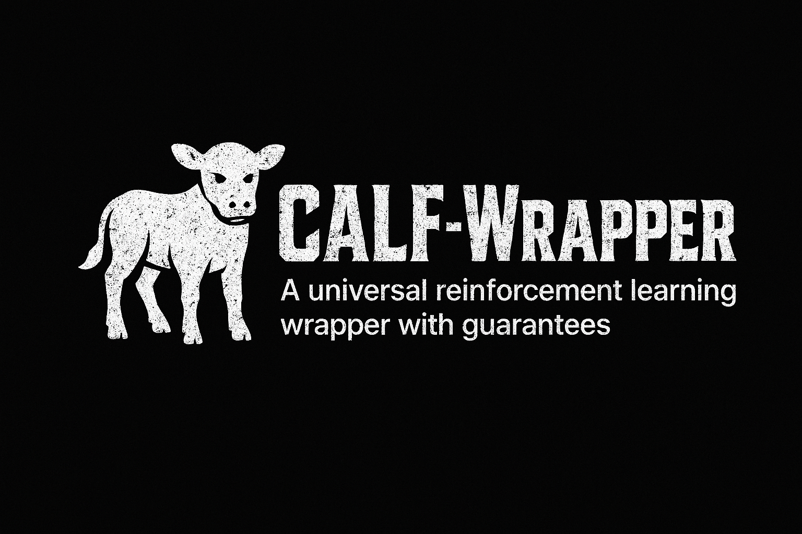

# CALF-Wrapper

[](https://www.python.org/downloads/)
[](https://opensource.org/licenses/MIT)

<p align="center">
  
</p>

Open-source implementation of the paper "Universal policy wrapper with guarantees".

## Overview

CALF-Wrapper provides a universal policy wrapper with formal guarantees. The repository contains:

- Implementation of the CALF wrapper algorithm
- Fallback Controllers for pendulum and cartpole tasks
- Training and evaluation scripts
- Reproduction scripts for paper experiments

## Project Structure

```
.
├── src/                  # Core implementation
│   ├── calf_wrapper.py   # Main CALF wrapper implementation
│   ├── controllers/      # Fallback controllers for pendulum and cartpole
│   ├── envs/             # Environment implementations (CartpoleSwingupEnv)
│   └── utils/            # Utility functions (mlflow, logging, etc.)
├── run/                  # Training and evaluation scripts
│   ├── train_ppo.py      # PPO training script
│   ├── eval.py           # Main evaluation script
│   └── scripts/          # Additional experiment scripts
└── reproduce/            # Reproduction experiments
```

## Installation

1. Install uv package manager:
```sh
# macOS/Linux
curl -LsSf https://astral.sh/uv/install.sh | sh

# Or follow the guide at https://docs.astral.sh/uv/getting-started/installation/
```

2. Create virtual environment:
```sh
uv venv --python=3.13
```

3. Install dependencies:
```sh
uv sync

# If the above fails:
rm -rf uv.lock
uv pip install -r pyproject.toml
```

## Reproducing Paper Results

The `reproduce/` directory contains evaluation scripts and configurations for reproducing the experimental results. The experiments are structured to evaluate both the base policy performance and CALF-wrapper effectiveness across different training stages.

### Cartpole Experiments ([`reproduce/cartpole/`](./reproduce/cartpole/))

#### Experiment Structure
- `base/`: Base policy evaluation across training stages
  - `early.sh` - Evaluates early-stage base policy checkpoint (not fully fitted)
  - `mid.sh` - Evaluates mid-stage training base policy checkpoint
  - `late.sh` - Evaluates late-stage training base policy checkpoint (fully trained)
- `calf_wrapper/`: CALF-wrapper evaluation matrix
  - Tests 3 run modes × 3 training stages = 9 configurations
  - Run modes:
    - `conservative/`: Prioritizes goal reaching
    - `balanced/`: Optimal trade-off between performance and goal reaching guarantees
    - `brave/`: Maximizes performance while maintaining minimal goal reaching guarantees on late-stage training checkpoints.
- `fallback.sh`: Fallback controller evaluation for CartpoleSwingupEnv

#### Reproduction Steps

Firstly, run training script

```sh
uv run run/train_ppo.py cartpole
```

Then run evaluation scripts:
```sh
# 1. Fallback Controller Baseline
bash cartpole/fallback.sh

# 2. Base Policy Evaluation Suite
bash cartpole/base/early.sh
bash cartpole/base/mid.sh
bash cartpole/base/late.sh

# 3. CALF-Wrapper Evaluation Matrix
# Conservative mode
bash cartpole/calf_wrapper/conservative/early.sh
bash cartpole/calf_wrapper/conservative/mid.sh
bash cartpole/calf_wrapper/conservative/late.sh

# Balanced mode 
bash cartpole/calf_wrapper/balanced/early.sh
bash cartpole/calf_wrapper/balanced/mid.sh
bash cartpole/calf_wrapper/balanced/late.sh

# Brave mode
bash cartpole/calf_wrapper/brave/early.sh
bash cartpole/calf_wrapper/brave/mid.sh
bash cartpole/calf_wrapper/brave/late.sh
```

### Cartpole Experiments ([`reproduce/pendulum/`](./reproduce/pendulum/))

#### Experiment Structure
- `base/`: Base policy evaluation across training stages
  - `early.sh` - Evaluates early-stage base policy checkpoint (not fully fitted)
  - `mid.sh` - Evaluates mid-stage training base policy checkpoint
  - `late.sh` - Evaluates late-stage training base policy checkpoint (fully trained)
- `calf_wrapper/`: CALF-wrapper evaluation matrix
  - Tests 3 run modes × 3 training stages = 9 configurations
  - Run modes:
    - `conservative/`: Prioritizes goal reaching
    - `balanced/`: Optimal trade-off between performance and goal reaching guarantees
    - `brave/`: Maximizes performance while maintaining minimal goal reaching guarantees on late-stage training checkpoints.
- `fallback.sh`: Fallback controller evaluation for Pendulum-v1

#### Reproduction Steps

Firstly, run training script

```sh
uv run run/train_ppo.py pendulum
```

Then run evalation scripts
```sh
# 1. Fallback Controller Baseline
bash pendulum/fallback.sh

# 2. Base Policy Evaluation Suite
bash pendulum/base/early.sh
bash pendulum/base/mid.sh
bash pendulum/base/late.sh

# 3. CALF-Wrapper Evaluation Matrix
# Conservative mode
bash pendulum/calf_wrapper/conservative/early.sh
bash pendulum/calf_wrapper/conservative/mid.sh
bash pendulum/calf_wrapper/conservative/late.sh

# Balanced mode 
bash pendulum/calf_wrapper/balanced/early.sh
bash pendulum/calf_wrapper/balanced/mid.sh
bash pendulum/calf_wrapper/balanced/late.sh

# Brave mode
bash pendulum/calf_wrapper/brave/early.sh
bash pendulum/calf_wrapper/brave/mid.sh
bash pendulum/calf_wrapper/brave/late.sh
```

## Mlflow

All the scripts above log their results into mlflow which can be hosted via

```sh
cd run
uv run mlflow ui --port 5000
```

And then visit [http://localhost:5000](http://localhost:5000) to see the logged results.

## Experiment Tracking

We use [MLflow](https://mlflow.org/) for comprehensive experiment tracking and results visualization. MLflow tracks:
- Training metrics (loss, rewards, episode lengths)
- Evaluation metrics (goal reaching rates, etc.)
- Environment parameters
- Run configurations and hyperparameters

### Viewing Results

Launch MLflow UI server:
```sh
cd run
uv run mlflow ui --port 5000
```

Access the dashboard at [http://localhost:5000](http://localhost:5000) to:
- Compare runs across different modes and stages
- View training/evaluation curves
- Analyze metrics distribution
- Export results for paper plots

For MLflow usage details, refer to their [documentation](https://mlflow.org/docs/latest/index.html).

## License

This project is released under the MIT License. See [LICENSE](./LICENSE) file for details.

```text
MIT License

Copyright (c) 2024 aidagroup

Permission is hereby granted, free of charge, to any person obtaining a copy
of this software and associated documentation files (the "Software"), to deal
in the Software without restriction, including without limitation the rights
to use, copy, modify, merge, publish, distribute, sublicense, and/or sell
copies of the Software, and to permit persons to whom the Software is
furnished to do so, subject to the following conditions:

The above copyright notice and this permission notice shall be included in all
copies or substantial portions of the Software.
```

