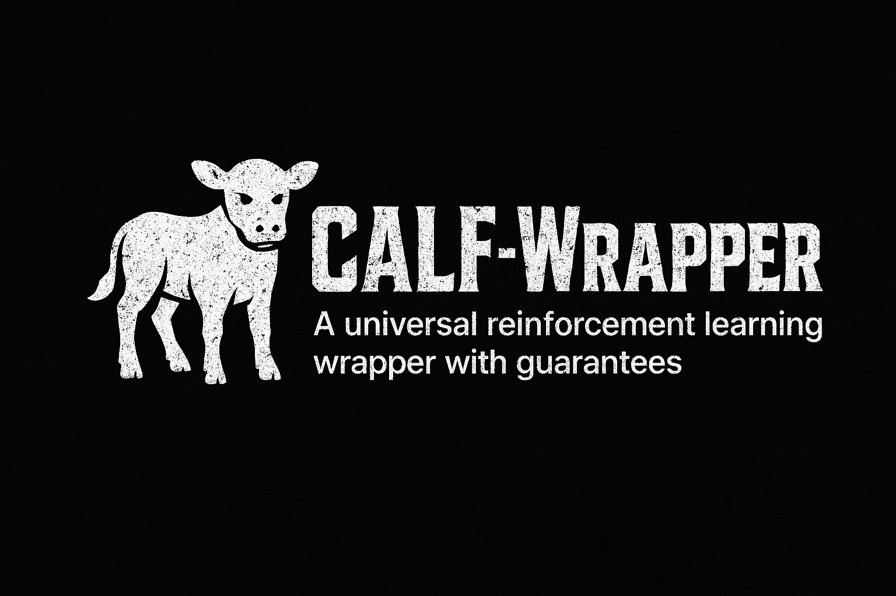
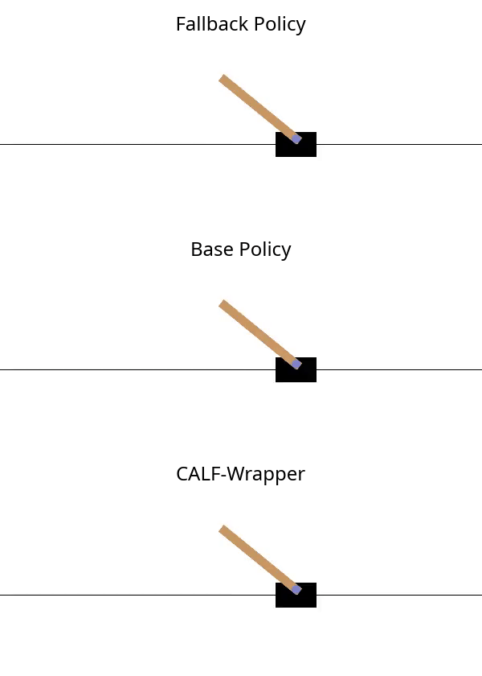

# CALF-Wrapper

[](https://www.python.org/downloads/)
[](https://opensource.org/licenses/MIT)

<p align="center">
  
</p>

Open-source implementation of the paper "Universal policy wrapper with guarantees".

## Overview

CALF-Wrapper is a runtime policy wrapper that enhances high-performance RL-trained policies (referred to as base policies). While classical RL methods can achieve impressive performance, they typically lack theoretical goal-reaching guarantees. By combining the base policy with a fallback policy (which can be any policy with goal-reaching capabilities, regardless of reward optimality), CALF-Wrapper produces a fused policy that maintains high performance while ensuring formal goal-reaching guarantees.

<p align="center">
  <em>Example with Cartpole Environment: The fallback policy successfully swings up the pole and centers the cart, but does so sub-optimally. The base policy effectively swings up the pole but fails to center the cart, lacking goal-reaching capabilities. CALF-Wrapper combines these policies to achieve both optimal performance and goal-reaching guarantees.</em>
</p>
<p align="center">
  
</p>

The repository contains:

- Implementation of the CALF wrapper algorithm
- Fallback controllers for pendulum, cartpole, underwater-drone, and robot-navigation tasks
- Training and evaluation scripts
- Reproduction scripts for paper experiments

The `UnderwaterDrone-v0` and `RobotNavigationConstSpeedCatch-v0`
environments are synchronized from
`aidagroup/calf-enhance@afb5edc49427054c99d6fbfe87b603d126724eb8` so the
new TD3 experiments use exactly the same task definitions as CALF-Enhance.
The required CALF-Enhance TD3 source tree is copied into
`vendor/calf-enhance-td3` at that revision. Its own `uv.lock` provides an
isolated runtime for exact CleanRL TD3 reproduction without changing the PPO
environment. No second repository or submodule checkout is required.

## Project Structure

```
.
├── src/                  # Core implementation
│   ├── calf_wrapper.py   # Main CALF wrapper implementation
│   ├── controllers/      # Fallback controllers for pendulum and cartpole
│   ├── envs/             # Environment implementations (CartpoleSwingupEnv)
│   └── utils/            # Utility functions (mlflow, logging, etc.)
├── run/                  # Training and evaluation scripts
│   ├── train_ppo.py      # PPO training script
│   ├── train_td3.py      # Vendored CALF-Enhance TD3 launcher
│   ├── eval.py           # Main evaluation cli-script
│   └── scripts/          # Additional experiment scripts
├── vendor/
│   └── calf-enhance-td3/ # Copied, independently locked TD3 runtime
└── reproduce/            # Reproduction experiments
```

## Installation

1. Install uv package manager:
```sh
# macOS/Linux
curl -LsSf https://astral.sh/uv/install.sh | sh

# Or follow the guide at https://docs.astral.sh/uv/getting-started/installation/
```

2. Create virtual environment:
```sh
uv venv --python=3.13
```

3. Install dependencies:
```sh
uv sync

# If the above fails:
rm -rf uv.lock
uv pip install -r pyproject.toml
```

## Reproducing Paper Results

The [`reproduce/`](./reproduce/) directory contains evaluation bash-scripts for reproducing the experimental results. The experiments are structured to evaluate both the base policy performance and CALF-wrapper effectiveness across different training stages.

## Reproducing CALF-Enhance TD3

`run/train_td3.py` delegates to the copied CleanRL trainer and locked
environment from the pinned CALF-Enhance commit. The copied trainer additionally
saves periodic and final model checkpoints locally and uploads them to the
MLflow run under `checkpoints/`. All artifacts are staged, uploaded in batches,
and downloaded again for size and SHA-256 verification before a batch is
acknowledged. This command runs the first
50,000 steps of the historical robot seed-1 run and checks every deterministic
MLflow metric against the original run:

```sh
uv run python run/train_td3.py robot-navigation \
  --seed 1 \
  --device cuda:1 \
  --total-timesteps 50000 \
  --learning-starts 25000 \
  --tracking-uri http://127.0.0.1:5001 \
  --experiment-name calf-wrapper/td3-enhance-reproduction \
  --run-name robot_seed1_exact_50k \
  --checkpoint-every 10000 \
  --reference-tracking-uri http://127.0.0.1:5000 \
  --reference-run-id 89aca0e282ec4363bf29c1679b71f01b \
  --comparison-report reports/results/td3-enhance/robot-seed1-50k.json
```

The checkpoint contains actor and critic weights, target networks, optimizer
states, the current observation, and random-number-generator states. Replay
buffer contents and simulator internals are intentionally not serialized, so
the file is suitable for evaluation and model provenance but is not an exact
mid-episode training-resume snapshot.

`run/eval.py` loads these `.pt` files through the inference-only
`CleanRLTD3` adapter for base-policy and CALF-wrapper evaluation.

The full experimental matrix uses ten seeds per environment and distributes
the resulting 20 jobs round-robin over the requested GPUs. Preview it first:

```sh
uv run python scripts/run_td3_matrix.py \
  --tracking-uri http://127.0.0.1:5001 \
  --gpus 0,1 \
  --dry-run
```

Remove `--dry-run` only from a clean pushed commit. The launcher creates one
detached `tmux` session per environment/seed pair and starts every session
immediately, distributing jobs round-robin over the requested GPUs. Every job
writes a separate local log under `run/logs/` and logs parameters, metrics, and
trajectories to MLflow. Full runs save a checkpoint every 30,000 steps by
default (100 checkpoints over 3M steps).
Use `--smoke --seeds 0` to validate the exact first 1,000-step execution prefix
for both environments before the full matrix.

> **Note:** 
> - All scripts in the [`reproduce/`](./reproduce/)  directory execute the main evaluation CLI tool [`run/eval.py`](./run/eval.py)
> - You can run evaluations directly with `uv run run/eval.py [ARGS]` using parameters from the bash scripts
> - For visualization, add the `--record-video` flag to any evaluation command to generate MP4 recordings
> - Additional CLI options can be found by running `uv run run/eval.py --help`

### Cartpole Experiments ([`reproduce/cartpole/`](./reproduce/cartpole/))

#### Experiment Structure
- `base/`: Base policy evaluation across training stages
  - `early.sh` - Evaluates early-stage base policy checkpoint (not fully fitted)
  - `mid.sh` - Evaluates mid-stage training base policy checkpoint
  - `late.sh` - Evaluates late-stage training base policy checkpoint (fully trained)
- `calf_wrapper/`: CALF-wrapper evaluation matrix
  - Tests 3 run modes × 3 training stages = 9 configurations
  - Run modes:
    - `conservative/`: Prioritizes goal reaching
    - `balanced/`: Optimal trade-off between performance and goal reaching guarantees
    - `brave/`: Maximizes performance while maintaining minimal goal reaching guarantees on late-stage training checkpoints.
- `fallback.sh`: Fallback controller evaluation for CartpoleSwingupEnv

#### Reproduction Steps

Firstly, run training script

```sh
uv run run/train_ppo.py cartpole --device cuda:0
```

Then run evaluation scripts:
```sh
# 1. Fallback Controller Baseline
bash reproduce/cartpole/fallback.sh

# 2. Base Policy Evaluation Suite
bash reproduce/cartpole/base/early.sh
bash reproduce/cartpole/base/mid.sh
bash reproduce/cartpole/base/late.sh

# 3. CALF-Wrapper Evaluation Matrix
# Conservative mode
bash reproduce/cartpole/calf_wrapper/conservative/early.sh
bash reproduce/cartpole/calf_wrapper/conservative/mid.sh
bash reproduce/cartpole/calf_wrapper/conservative/late.sh

# Balanced mode 
bash reproduce/cartpole/calf_wrapper/balanced/early.sh
bash reproduce/cartpole/calf_wrapper/balanced/mid.sh
bash reproduce/cartpole/calf_wrapper/balanced/late.sh

# Brave mode
bash reproduce/cartpole/calf_wrapper/brave/early.sh
bash reproduce/cartpole/calf_wrapper/brave/mid.sh
bash reproduce/cartpole/calf_wrapper/brave/late.sh
```

### Pendulum Experiments ([`reproduce/pendulum/`](./reproduce/pendulum/))

#### Experiment Structure
- `base/`: Base policy evaluation across training stages
  - `early.sh` - Evaluates early-stage base policy checkpoint (not fully fitted)
  - `mid.sh` - Evaluates mid-stage training base policy checkpoint
  - `late.sh` - Evaluates late-stage training base policy checkpoint (fully trained)
- `calf_wrapper/`: CALF-wrapper evaluation matrix
  - Tests 3 run modes × 3 training stages = 9 configurations
  - Run modes:
    - `conservative/`: Prioritizes goal reaching
    - `balanced/`: Optimal trade-off between performance and goal reaching guarantees
    - `brave/`: Maximizes performance while maintaining minimal goal reaching guarantees on late-stage training checkpoints.
- `fallback.sh`: Fallback controller evaluation for Pendulum-v1

#### Reproduction Steps

Firstly, run training script

```sh
uv run run/train_ppo.py pendulum --device cuda:0
```

Then run evaluation scripts
```sh
# 1. Fallback Controller Baseline
bash reproduce/pendulum/fallback.sh

# 2. Base Policy Evaluation Suite
bash reproduce/pendulum/base/early.sh
bash reproduce/pendulum/base/mid.sh
bash reproduce/pendulum/base/late.sh

# 3. CALF-Wrapper Evaluation Matrix
# Conservative mode
bash reproduce/pendulum/calf_wrapper/conservative/early.sh
bash reproduce/pendulum/calf_wrapper/conservative/mid.sh
bash reproduce/pendulum/calf_wrapper/conservative/late.sh

# Balanced mode 
bash reproduce/pendulum/calf_wrapper/balanced/early.sh
bash reproduce/pendulum/calf_wrapper/balanced/mid.sh
bash reproduce/pendulum/calf_wrapper/balanced/late.sh

# Brave mode
bash reproduce/pendulum/calf_wrapper/brave/early.sh
bash reproduce/pendulum/calf_wrapper/brave/mid.sh
bash reproduce/pendulum/calf_wrapper/brave/late.sh
```

## Mlflow

All the scripts above log their results into mlflow which can be hosted via

```sh
cd run
uv run mlflow ui --port 5000
```

And then visit [http://localhost:5000](http://localhost:5000) to see the logged results.

### Reproducible remote workflow

The isolated PostgreSQL/MinIO/MLflow deployment is documented in
[`infra/README.md`](infra/README.md). It uses ports 5001, 9030, and 9031 and
does not share state with CALF-Enhance.

Preview the complete two-environment workload without launching it:

```sh
uv run python scripts/run_reproduction.py \
  --tracking-uri http://127.0.0.1:5001 \
  --artifact-root artifacts/reproduction \
  --training-device cuda:0 \
  --dry-run
```

Remove `--dry-run` only from a clean pushed commit. The launcher deliberately
refuses dirty or unpushed experiment code. Use `--smoke` for a 3,000-step
training and short evaluation check before the full workload.
The published PPO checkpoint tensors are exactly reproducible with CUDA
training. CPU training is deterministic on a fixed machine but follows a
different numerical trajectory, so use `--training-device cpu` only for an
explicit device-ablation run.

Export completed runs and compare the metrics without rounding:

```sh
uv run python scripts/export_results.py \
  --tracking-uri http://127.0.0.1:5001 \
  --output-dir reports/generated/full \
  --reference-dir reference-results
uv run python scripts/compare_results.py \
  --reference-dir reference-results \
  --actual-dir reports/generated/full \
  --output reports/generated/full/comparison.json
```

The plotting environment and byte-for-byte PDF reproduction instructions are
in [`publication/README.md`](publication/README.md).
The export contains `runs.csv` (one aggregate row per selected run),
`trials.csv` (all 30 individual trials per run), per-environment plotting JSON,
and a provenance sidecar identifying any imported plot-only baseline.
The completed local/remote audit, exact replay verdicts, fresh-training results,
run IDs, and artifact hashes are in
[`reports/reproducibility.md`](reports/reproducibility.md).

### Full checkpoint-mode sweep

The preregistered checkpoint and hyperparameter protocol is stored in
[`experiments/checkpoint-sweep-v1.json`](experiments/checkpoint-sweep-v1.json).
It evaluates every checkpoint within the published training horizon using the
base policy and four horizon-normalized CALF modes. The fallback is evaluated
once per environment because it does not depend on a checkpoint.

Preview the complete task matrix, then launch it from a clean pushed commit:

```sh
uv run python scripts/run_checkpoint_matrix.py launch \
  --tracking-uri http://192.168.1.5:5001 \
  --gpus 0,1 \
  --dry-run

uv run python scripts/run_checkpoint_matrix.py launch \
  --tracking-uri http://192.168.1.5:5001 \
  --gpus 0,1
```

Each GPU gets a persistent tmux worker. A separate monitor creates the complete
CSV table after all tasks finish and uploads the protocol, task manifest, raw
results table, and any failures to a matrix-level MLflow run. Every task-level
artifact batch and the final matrix batch are downloaded again and verified by
size and SHA-256. Re-running the same matrix directory resumes from existing
task summaries.

## Experiment Tracking

We use [MLflow](https://mlflow.org/) for comprehensive experiment tracking and results visualization. MLflow tracks:
- Training metrics (loss, rewards, episode lengths)
- Evaluation metrics (goal reaching rates, etc.)
- Environment parameters
- Run configurations and hyperparameters

### Viewing Results

Launch MLflow UI server:
```sh
cd run
uv run mlflow ui --port 5000
```

Access the dashboard at [http://localhost:5000](http://localhost:5000) to:
- Compare runs across different modes and stages
- View training/evaluation curves
- Analyze metrics distribution
- Export results for paper plots

For MLflow usage details, refer to their [documentation](https://mlflow.org/docs/latest/index.html).

## License

This project is released under the MIT License. See [LICENSE](./LICENSE) file for details.

```text
MIT License

Copyright (c) 2024 aidagroup

Permission is hereby granted, free of charge, to any person obtaining a copy
of this software and associated documentation files (the "Software"), to deal
in the Software without restriction, including without limitation the rights
to use, copy, modify, merge, publish, distribute, sublicense, and/or sell
copies of the Software, and to permit persons to whom the Software is
furnished to do so, subject to the following conditions:

The above copyright notice and this permission notice shall be included in all
copies or substantial portions of the Software.
```
